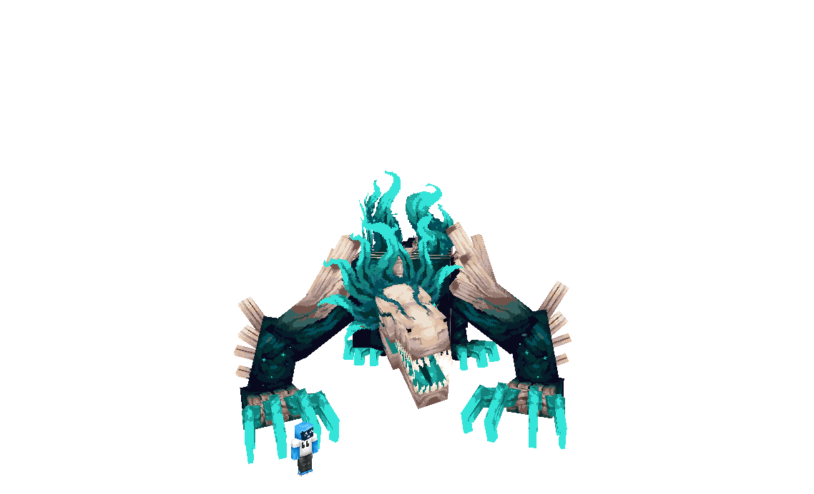
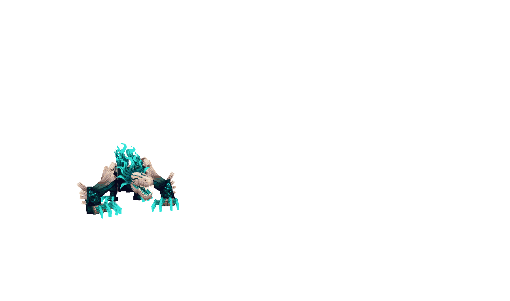

# Gluttony — 《暴食》

> *“它从深暗之城中苏醒，循着杀戮的气息生长。”*

---

### 这是什么？

-----

**Gluttony**​ 是一个为 Minecraft 设计的 Boss 模组，围绕一只名为「暴食」的可成长生物展开。

它从深暗之城的蛋中孵化，通过猎杀其他生物积累力量，跨越五个阶段，最终成为追逐玩家的终极掠食者。每一个被它吞噬的生物，都会改变它的行为模式——吃掉末影人获得瞬移能力，吃掉苦力怕为攻击附加爆炸，吃掉监守者解锁音波尖啸……

--- 

部分美术画面 (内容还在开发中)

